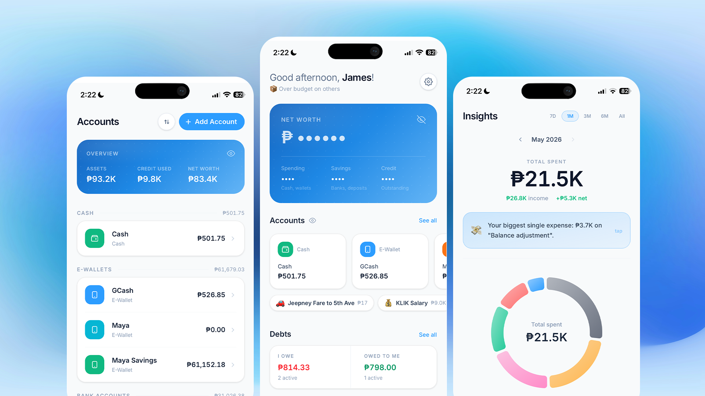

# Spendr

**A mobile-first personal finance PWA built for Filipinos.**


-FF6B35?style=flat)


> Track expenses, manage credit cards, log debts, and visualize spending — all offline, synced when you're back online.



---

## Features

- **Offline-first** — all data lives in IndexedDB (Dexie.js); works without any connection
- **Cross-device sync** — optional Supabase backend with `updated_at` conflict resolution
- **Transaction logging** — expense, income, and transfer flows with a custom numeric keypad
- **Account hierarchy** — group GCash Wallet + GCash Savings under one "GCash" parent
- **Credit card intelligence** — live available credit computed from billing cycle transactions, not a stored balance
- **Budget tracking** — per-category monthly limits with compact 2-column chip grid on home and insights
- **Debts** — track "I lent / I owe" with partial payment history and overdue detection
- **Recurring bills** — daily/weekly/monthly/yearly with one-tap "Pay Now" that auto-advances the next date
- **Analytics** — donut, bar, and area charts with month navigation
- **Data export** — CSV, full JSON backup, monthly PDF report
- **Accent color system** — 8 presets + custom hex; every UI element adapts in real time
- **QR codes** — attach a payment QR (5:7 crop, base64) to any account; synced across devices
- **48 Philippine presets** — GCash, Maya, BPI, BDO, UnionBank, and more

---

## Tech Stack

| Layer | Technology |
|---|---|
| Framework | React 18 + Vite |
| Styling | Tailwind CSS v4 |
| Routing | React Router v6 |
| Local DB | Dexie.js (IndexedDB) |
| Backend / Auth | Supabase (PostgreSQL + RLS) |
| Charts | Recharts |
| PDF Export | @react-pdf/renderer |
| CSV Parsing | PapaParse |
| Drag & Drop | @dnd-kit/core + @dnd-kit/sortable |
| Image Crop | react-image-crop |
| PWA | vite-plugin-pwa + Workbox |

---

## Getting Started

```bash
git clone https://github.com/jeymsx/spendr-v2.git
cd spendr-v2
npm install
cp .env.example .env.local   # add your Supabase keys (optional)
npm run dev
```

The app runs fully offline without Supabase keys. Auth and sync features are simply unavailable.

---

## Environment Variables

```
VITE_SUPABASE_URL=
VITE_SUPABASE_ANON_KEY=
```

See `.env.example` for the full list.

---

## Supabase Setup (optional)

If you want sync, run these migrations in your Supabase SQL editor:

```sql
ALTER TABLE accounts ADD COLUMN IF NOT EXISTS parent_name TEXT;
ALTER TABLE accounts ADD COLUMN IF NOT EXISTS sort_order   INT DEFAULT 0;
ALTER TABLE accounts ADD COLUMN IF NOT EXISTS qr_image     TEXT;
```

Tables: `transactions`, `accounts`, `categories`, `debts`, `recurring`, `templates`, `user_preferences`

---

*Built by [James Sablay](https://github.com/jeymsx) · 2024–2025*
